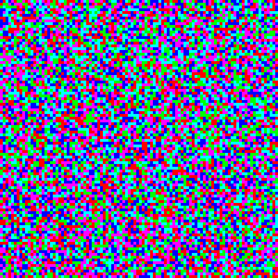

# The Iterated Prisoner's Dilemma on a Network of Connected Agents
 

## What Is This?
This repository contains the code written for my Physics BSc project at Imperial College London, the thesis for which can be found [here](From_Simple_Games_to_Complex_Behaviours.pdf). 
This was a fairly freeform project, just playing with extending the Iterated Prisoner's Dilemma problem over a network of connected agents.
Initially, a version of the project was written in [Python](/python), but this was soon abandoned in favour of C++ as the size of networks we wanted to experiment with were taking far too long to process.

## How an experiment works
Consider a network of agents, or players in the game.
Each round, every agent plays the iterated prisoner's dilemma against each of their neighbours, playing according to some strategy over a number of games.
For example the simplest strategies would be 'Always Cooperate' and 'Always Defect', but they can be a little more nuanced like a 'Tit-for-Tat' strategy, that will cooperate in the first game, and then mirror their opponent's previous move back at them in subsequent games.

After some fixed number of games have been played between every pair of connected agents, the round ends, and each agent may change their strategy according to some update rule.
For example under the 'Threshold' rule, each agent adds up their score from all the games against all of their neighbours, and compares it to the total score of those neighbours.
If an agent has been outscored by more than half of their neighbours, they will change their strategy to copy that of their highest scoring neighbour.

A new round then begins, and the process starts over again, and repeats some fixed number of times. An example of the evolution of the network over this is shown in the animation above, where the colour of a square respresents the strategy that that agent used for that round.

The whole process may then be repeated many times, in order to give more statistical weight to any conclusions.

## How is this code used?
To be honest, during the project, it was simply modified, built, and run for each experiment that took my fancy.
In preparation for uploading it to GitHub, I've made some token effort to clean it up, create some semblance of a user-interface, and created the Experiments.cpp to allow different experiments with different parameters to be run, but it is certainly far from done.
One need only look at all of the commented out [functions and codeblocks in the main.cpp](https://github.com/A-Lee-0/BSc-Project/blob/main/src/main.cpp) to see that!

The exact parameters that can be set are different for each experiment (and can be listed with the `params` command), but some common ones are the dimensions of the rectangular network, the method used to set the initial strategies of the agents, the rule for changing strategy, and flags for whether to save images and statistical data to disk.

I hope to migrate/implement a broader range of experiment types, improve the user-interface, and perhaps add some automatic graphing, but this is at least a minimum usable version to post publicly.
